# Lab 01: Explore Azure Synapse Analytics

## Lab Scenario

Azure Synapse Analytics provides a single, consolidated data analytics platform for end-to end data analytics. In this exercise, you'll explore various ways to ingest and explore data. This exercise is designed as a high-level overview of the various core capabilities of Azure Synapse Analytics. Other exercises are available to explore specific capabilities in more detail.

## Objectives
  
After completing this lab, you will be able to:

+ Task 1: Provision an Azure Synapse Analytics workspace.
+ Task 2: Explore Synapse Studio.
+ Task 3: Ingesting data with a pipeline in Synapse Studio.
+ Task 4: Analyze data using a serverless SQL pool.
+ Task 5: Analyze data using the Spark pool.
+ Task 6: Query a data warehouse using a dedicated SQL pool.

### Estimated timing: 60 minutes

## Architecture Diagram

   

## Task 1: Provision an Azure Synapse Analytics workspace

An Azure *Synapse Analytics workspace* provides a central point for managing data and data processing runtimes. You can provision a workspace using the interactive interface in the Azure portal, or you can deploy a workspace and resources within it by using a script or template. In most production scenarios, it's best to automate provisioning with scripts and templates so that you can incorporate resource deployment into a repeatable development and operations (*DevOps*) process.

In this task, we will provision an Azure Synapse Analytics workspace using a PowerShell script and an ARM template. We will set up a Cloud Shell, clone a repository, and execute a setup script to create the necessary resources.

1. Use the **[\>_]** button to the right of the search bar at the top of the page to create a new Cloud Shell in the **Azure portal**.

    

1. The first time you open the Cloud Shell, you may be prompted to choose the type of shell you want to use (Bash or PowerShell). If so, select PowerShell.

    

    > **Note**: If you have previously created a cloud shell that uses a *Bash* environment, use the the drop-down menu at the top left of the cloud shell pane to change it to ***PowerShell***.

1. On Getting started window choose **Mount storage account(1)** then under Storage account subscription select your available **subscription (2)** from the dropdown and click on **Apply (3)**.

   

1. Within the Mount storage account pane, select **we will create a storage aacount for you (1)** and click **Next (2)**.

    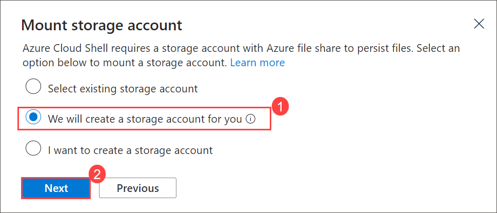.

1. Note that you can resize the cloud shell by dragging the separator bar at the top of the pane, or by using the **&#8212;**, **&#9723;**, and **X** icons at the top right of the pane to minimize, maximize, and close the pane. For more information about using the Azure Cloud Shell, see the [Azure Cloud Shell documentation](https://docs.microsoft.com/azure/cloud-shell/overview).

1. In the PowerShell pane, enter the following commands to clone this repo:

    ```
    rm -r synapse -f
    git clone https://github.com/CloudLabsAI-Azure/Data-Analytics-with-Azure-Synapse synapse
    ```

1. After the repo has been cloned, enter the following commands to change to the folder for this exercise and run the **setup.ps1** script it contains:

    ```
    cd synapse/Allfiles/labs/01
    ./setup.ps1
    ```

1. If prompted, choose which subscription you want to use (this will only happen if you have access to multiple Azure subscriptions).

1. When prompted, enter a suitable password to be set for your Azure Synapse SQL pool.

    > **Note**: Be sure to remember this password!

    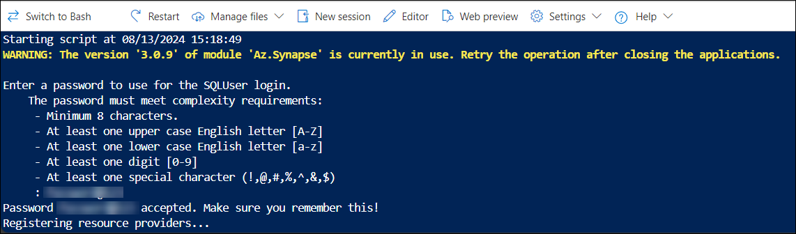

1. Wait for the script to complete - this typically takes around 20 minutes, but in some cases may take longer. While you are waiting, review the [What is Azure Synapse Analytics?](https://docs.microsoft.com/azure/synapse-analytics/overview-what-is) article in the Azure Synapse Analytics documentation.

## Task 2: Explore Synapse Studio

*Synapse Studio* is a web-based portal in which you can manage and work with the resources in your Azure Synapse Analytics workspace.

In this task, we will explore Synapse Studio by navigating through its various pages, including Data, Develop, Integrate, Monitor, and Manage, to understand its capabilities for managing and analyzing data.

1. After the script has completed, in the Azure portal, go to the **analytics** resource group that it created, and select your **Synapse workspace**.

    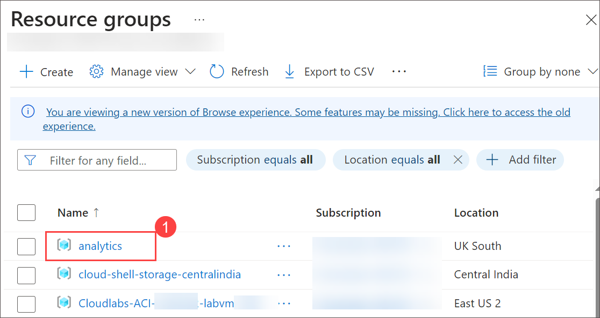

    .png)
   
1. In the **Overview** page for your Synapse workspace, in the **Open Synapse Studio** card, select **Open** to open Synapse Studio in a new browser tab; signing in if prompted.

   .png)

4. On the left side of Synapse Studio, use the **&rsaquo;&raquo;** icon to expand the menu - this reveals the different pages within Synapse Studio that you'll use to manage resources and perform data analytics tasks, as shown here:

    .png)

5. View the **Data** page, and note that there are two tabs containing data sources:
    - A **Workspace** tab containing databases defined in the workspace (including dedicated SQL databases and Data Explorer databases)
    - A **Linked** tab containing data sources that are linked to the workspace, including Azure Data Lake storage.

6. View the **Develop** page, which is currently empty. This is where you can define scripts and other assets used to develop data processing solutions.

7. View the **Integrate** page, which is also empty. You use this page to manage data ingestion and integration assets; such as pipelines to transfer and transform data between data sources.

8. View the **Monitor** page. This is where you can observe data processing jobs as they run and view their history.

9. View the **Manage** page. This is where you manage the pools, runtimes, and other assets used in your Azure Synapse workspace. View each of the tabs in the **Analytics pools** section and note that your workspace includes the following pools:
    - **SQL pools**:
        - **Built-in**: A *serverless* SQL pool that you can use on-demand to explore or process data in a data lake by using SQL commands.
        - **sql*xxxxxxx***: A *dedicated* SQL pool that hosts a relational data warehouse database.
    
           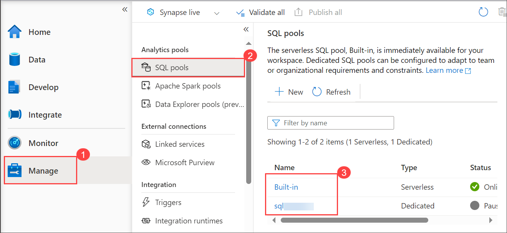
    
    - **Apache Spark pools**:
        - **spark*xxxxxxx***: that you can use on-demand to explore or process data in a data lake by using programming languages like Scala or Python.

          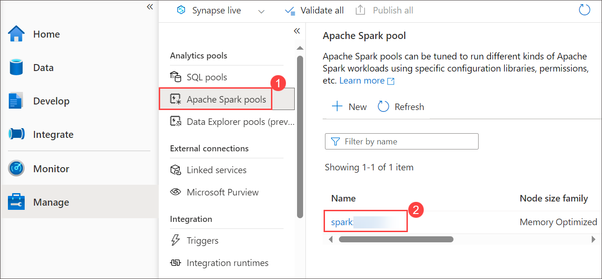

## Task 3: Ingest data with a pipeline

One of the key tasks you can perform with Azure Synapse Analytics is to define *pipelines* that transfer (and if necessary, transform) data from a wide range of sources into your workspace for analysis.

In this task, we will ingest data into Azure Synapse Analytics by creating a pipeline using the Copy Data tool, transferring data from an HTTP source to Azure Data Lake Storage Gen2, and verify the successful ingestion of the data.

###  Task 3.1: Use the Copy Data task to create a pipeline

1. In Synapse Studio, on the **Home** page, select **Ingest** to open the **Copy Data** tool

     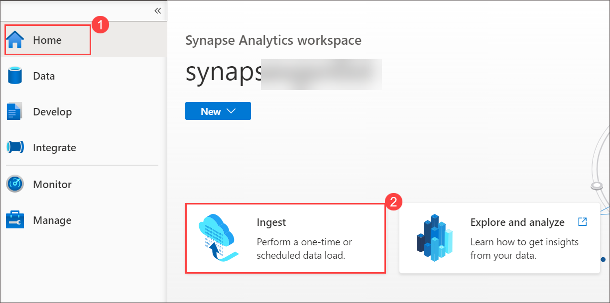

2. In the Copy Data tool, on the **Properties** step, ensure that **Built-in copy task** and **Run once now** are selected, and click **Next >**.
      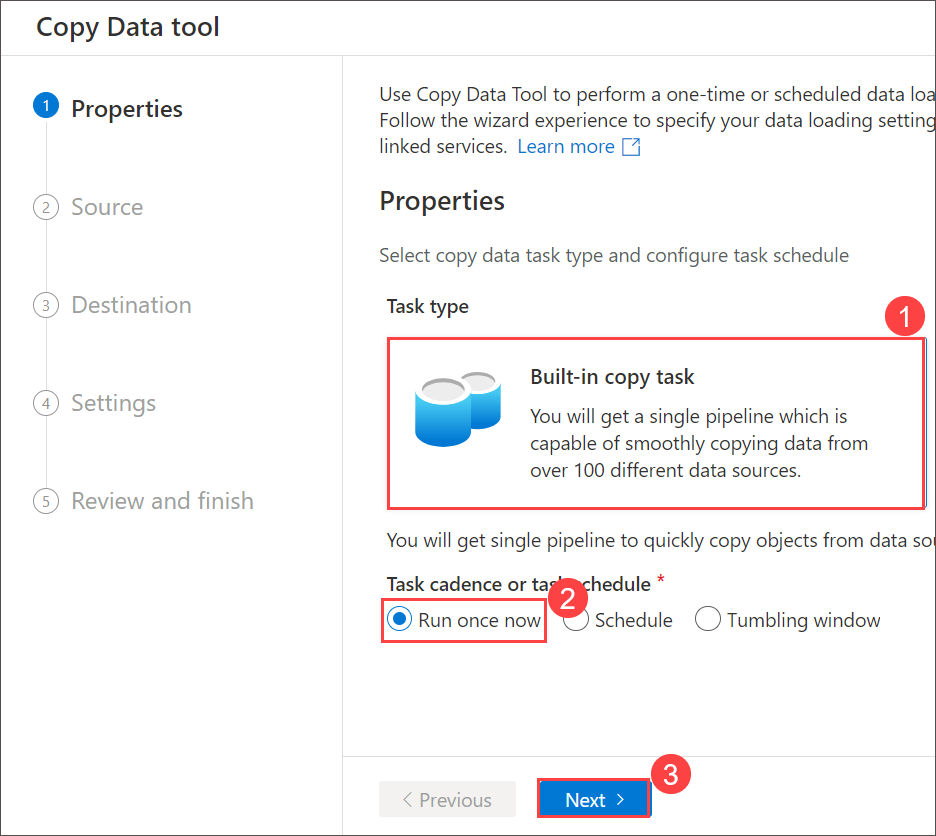

3. On the **Source** step, in the **Dataset** substep, select the following settings:
    - **Source type**: All
    - **Connection**: Select **+ New connection**, and in the **New Connection** pane that appears, on the **Generic protocol** tab, select **HTTP**. Then continue and create a connection to a data file using the following settings and click **Create**:*
        - **Name**: Products
        - **Description**: Product list via HTTP
        - **Connect via integration runtime**: AutoResolveIntegrationRuntime
        - **Base URL**: `https://raw.githubusercontent.com/CloudLabsAI-Azure/Data-Analytics-with-Azure-Synapse/main/Allfiles/labs/01/adventureworks/products.csv`
        - **Server Certificate Validation**: Enable
        - **Authentication type**: Anonymous
     
           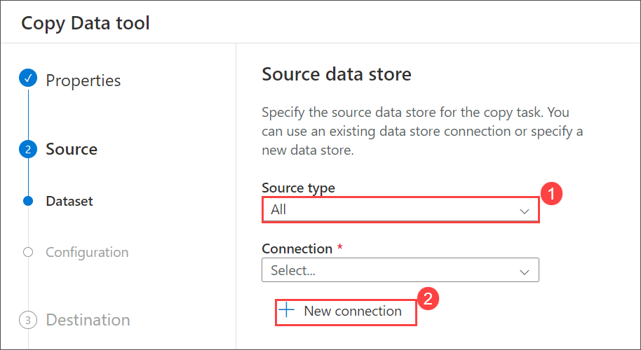

           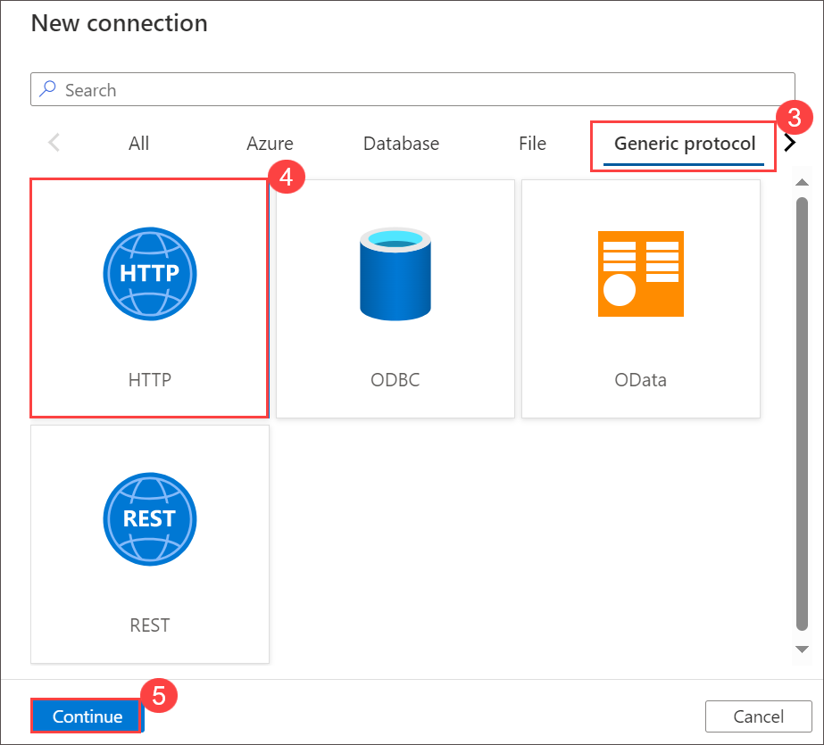

           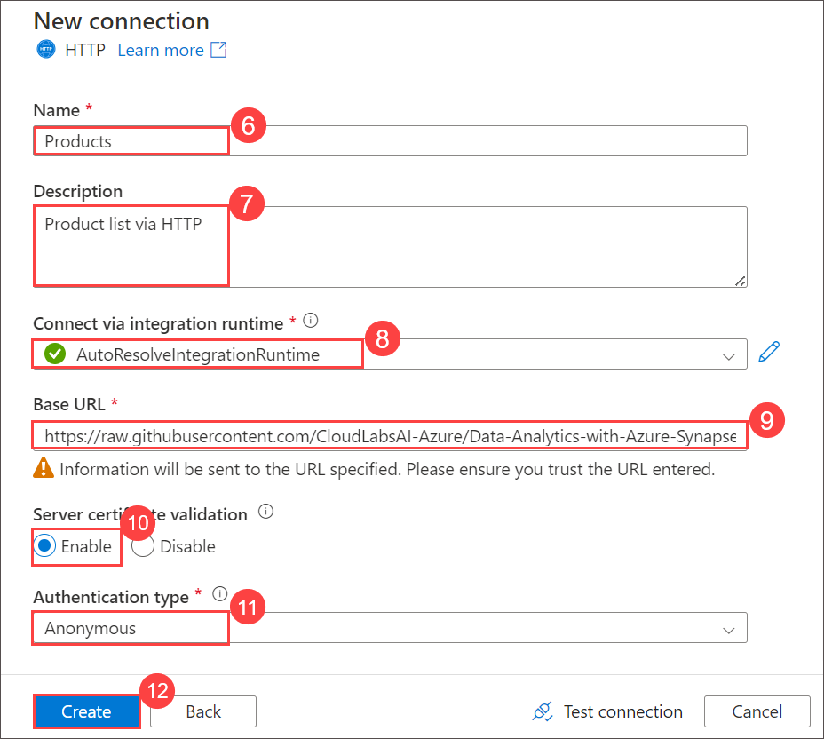

4. After creating the connection, on the **Source data store** page, ensure the following settings are selected, and then select **Next >**:
    - **Relative URL**: *Leave blank*
    - **Request method**: GET
    - **Additional headers**: *Leave blank*
    - **Binary copy**: <u>Un</u>selected
    - **Request timeout**: *Leave blank*
    - **Max concurrent connections**: *Leave blank*

      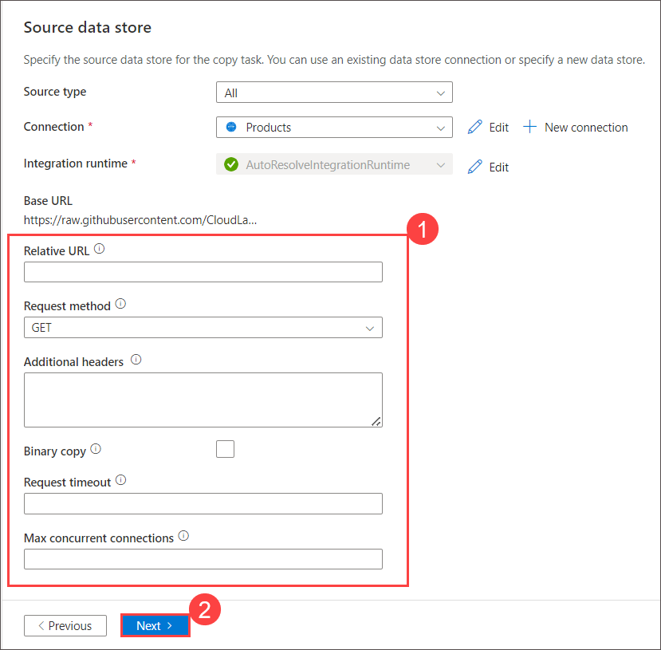

5. On the **Source** step, in the **Configuration** substep, select **Preview data** to see a preview of the product data your pipeline will ingest, then close the preview.

6. After previewing the data, on the **File format settings** page, ensure the following settings are selected, and then select **Next >**:
    - **File format**: DelimitedText
    - **Column delimiter**: Comma (,)
    - **Row delimiter**: Line feed (\n)
    - **First row as header**: Selected
    - **Compression type**: *Leave blank*

       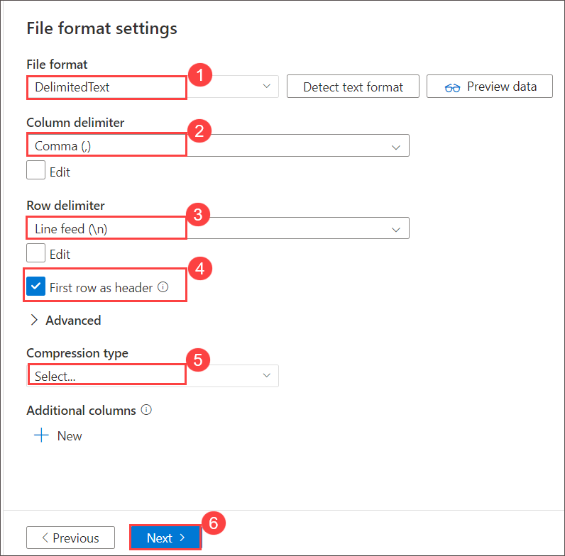
      
7. On the **Destination** step, in the **Dataset** substep, select the following settings:
    - **Destination type**: Azure Data Lake Storage Gen 2
    - **Connection**: *Select the existing connection to your data lake store (this was created for you when you created the workspace).*

8. After selecting the connection, on the **Destination/Dataset** step, ensure the following settings are selected, and then select **Next >**:
    - **Folder path**: Click on Browse and select files/sales_data 
    - **File name**: sales.csv
    - **Copy behavior**: *Leave blank*
    - **Max concurrent connections**: *Leave blank*
    - **Block size (MB)**: *Leave blank*

      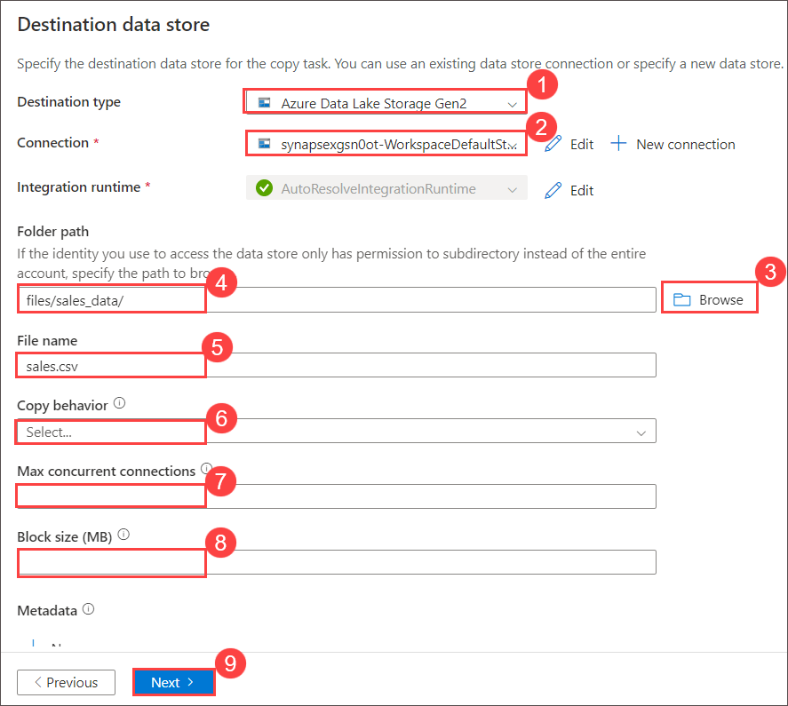

9. On the **Destination** step, in the **Configuration** substep, on the **File format settings** page, ensure that the following properties are selected. Then select **Next >**:

    - **File format**: DelimitedText
    - **Column delimiter**: Comma (,)
    - **Row delimiter**: Line feed (\n)
    - **Add header to file**: Selected
    - **Compression type**: *Leave blank*
    - **Max rows per file**: *Leave blank*
    - **File name prefix**: *Leave blank*

      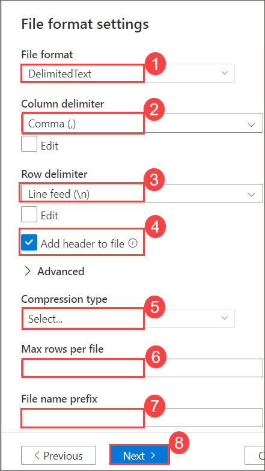

10. On the **Settings** step, enter the following settings and then click **Next >**:
    - **Task name**: Copy products
    - **Task description** Copy products data
    - **Fault tolerance**: *Leave blank*
    - **Enable logging**: <u>Un</u>selected
    - **Enable staging**: <u>Un</u>selected

      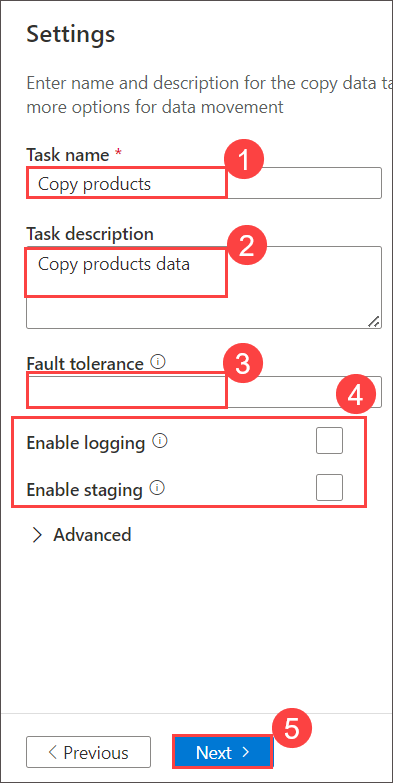

11. On the **Review and finish** step, on the **Review** substep, read the summary and then click **Next >**.

12. On the **Deployment** step, wait for the pipeline to be deployed and then click **Finish**.

13. In Synapse Studio, select the **Monitor** page, and in the **Pipeline runs** tab, wait for the **Copy products** pipeline to complete with a status of **Succeeded** (you can use the **&#8635; Refresh** button on the Pipeline runs page to refresh the status).

     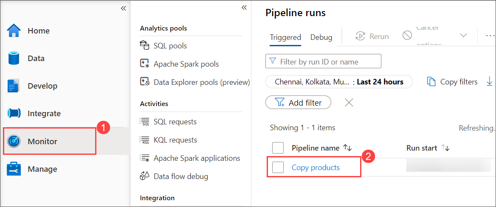

     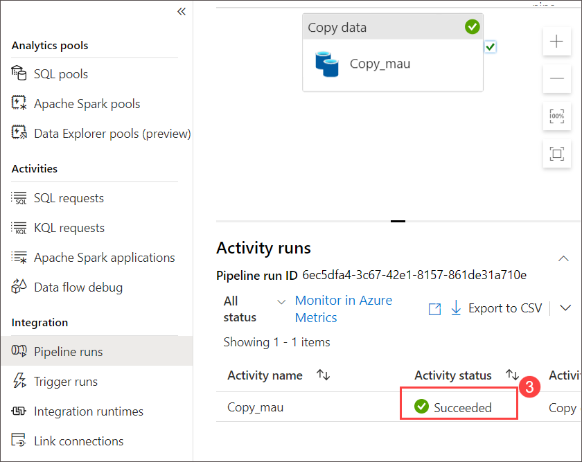
    
14. View the **Integrate** page, and verify that it now contains a **pipeline** named **Copy products**.

    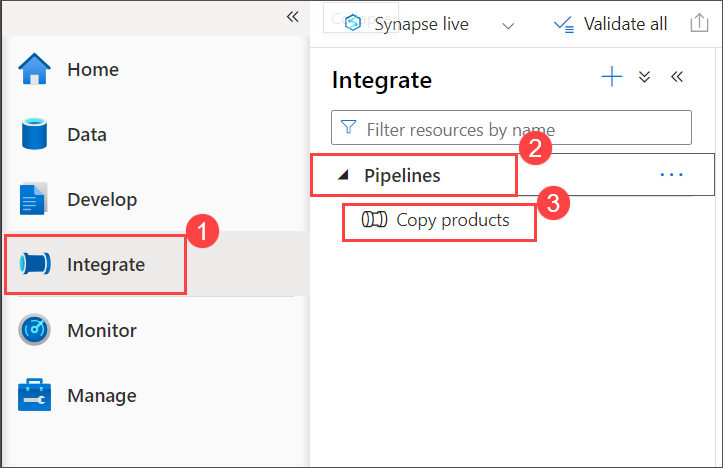

### Task 3.2: View the ingested data

1. On the **Data** page, select the **Linked** tab and expand the **Azure Data Lake Storage Gen2** and then expand **synapse*xxxxxxx* (Primary) datalake** container hierarchy until you see the **files** file storage for your Synapse workspace. Then select the file storage to verify that a folder named **sales_data** containing a file named **sales.csv** has been copied to this location, as shown here:

    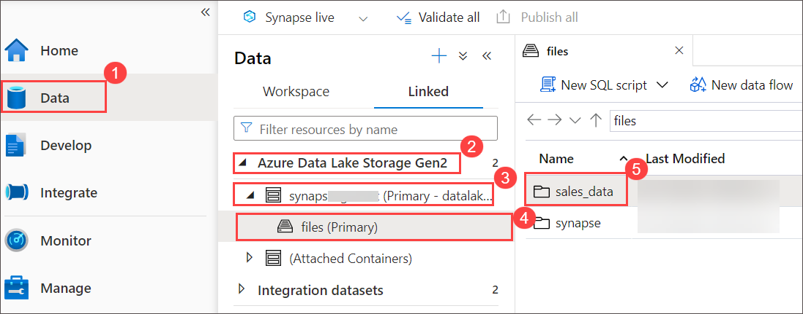

   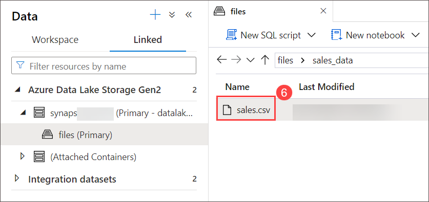

3. Right-click the **sales.csv** data file and select **Preview** to view the ingested data. Then click on **OK** to exit preview page.

     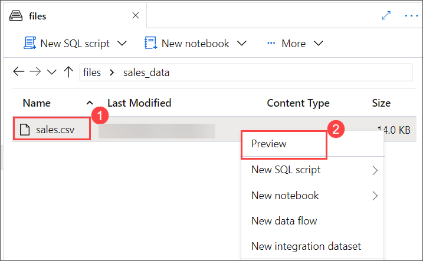

     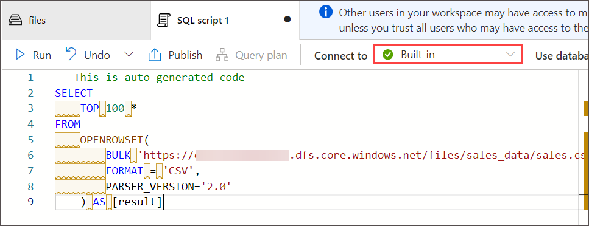

   <validation step="839cbf4c-f048-4b81-bb5f-a2d033dc3e26" />

 > **Congratulations** on completing the lab! Now, it's time to validate it. Here are the steps:
 > - Hit the Validate button for the corresponding task. If you receive a success message, you have successfully validated the lab. 
 > - If not, carefully read the error message and retry the step, following the instructions in the lab guide.
 > - If you need any assistance, please contact us at cloudlabs-support@spektrasystems.com. We are available 24/7 to help you out.
  
 <validation step="839cbf4c-f048-4b81-bb5f-a2d033dc3e26" />

## Task 4: Use a serverless SQL pool to analyze data

Now that you've ingested some data into your workspace, you can use Synapse Analytics to query and analyze it. One of the most common ways to query data is to use SQL, and in Synapse Analytics you can use a serverless SQL pool to run SQL code against data in a data lake.

In this task, we will use a serverless SQL pool to query and analyze data stored in Azure Data Lake. We will execute SQL queries to retrieve and aggregate data and visualize the results using charts

1. In Synapse Studio, right-click the **sales.csv** file in the file storage for your Synapse workspace, point to **New SQL script**, and select **Select TOP 100 rows**.
2. In the **SQL Script 1** pane that opens, review the SQL code that has been generated, which should be similar to this:

    ```SQL
    -- This is auto-generated code
    SELECT
        TOP 100 *
    FROM
        OPENROWSET(
            BULK 'https://datalakexxxxxxx.dfs.core.windows.net/files/sales_data/sales.csv',
            FORMAT = 'CSV',
            PARSER_VERSION='2.0'
        ) AS [result]
    ```

    This code  opens a rowset from the text file you imported and retrieves the first 100 rows of data.

3. In the **Connect to** list, ensure **Built-in** is selected - this represents the built-in SQL Pool that was created with your workspace.

    

4. In the code (replacing *datalakexxxxxxx* with the name of your data lake storage account) on the toolbar, use the **&#9655; Run** button to run the SQL code, and review the results, which should look similar to this:

    | C1 | C2 | C3 | C4 |
    | -- | -- | -- | -- |
    | ProductID | ProductName | Category | ListPrice |
    | 771 | Mountain-100 Silver, 38 | Mountain Bikes | 3399.9900 |
    | 772 | Mountain-100 Silver, 42 | Mountain Bikes | 3399.9900 |
    | ... | ... | ... | ... |

5. Note the results consist of four columns named C1, C2, C3, and C4; and that the first row in the results contains the names of the data fields. To fix this problem, add a HEADER_ROW = TRUE parameters to the OPENROWSET function as shown here (replacing *datalakexxxxxxx* with the name of your data lake storage account), and then rerun the query:

    ```SQL
    SELECT
        TOP 100 *
    FROM
        OPENROWSET(
            BULK 'https://datalakexxxxxxx.dfs.core.windows.net/files/sales_data/sales.csv',
            FORMAT = 'CSV',
            PARSER_VERSION='2.0',
            HEADER_ROW = TRUE
        ) AS [result]
    ```

    Now the results look like this:

    | ProductID | ProductName | Category | ListPrice |
    | -- | -- | -- | -- |
    | 771 | Mountain-100 Silver, 38 | Mountain Bikes | 3399.9900 |
    | 772 | Mountain-100 Silver, 42 | Mountain Bikes | 3399.9900 |
    | ... | ... | ... | ... |

6. Modify the query as follows (replacing *datalakexxxxxxx* with the name of your data lake storage account):

    ```SQL
    SELECT
        Category, COUNT(*) AS ProductCount
    FROM
        OPENROWSET(
            BULK 'https://datalakexxxxxxx.dfs.core.windows.net/files/sales_data/sales.csv',
            FORMAT = 'CSV',
            PARSER_VERSION='2.0',
            HEADER_ROW = TRUE
        ) AS [result]
    GROUP BY Category;
    ```

7. Run the modified query, which should return a resultset that contains the number products in each category, like this:

    | Category | ProductCount |
    | -- | -- |
    | Bib Shorts | 3 |
    | Bike Racks | 1 |
    | ... | ... |

8. In the **Properties** pane for **SQL Script 1**, change the **Name** to **Count Products by Category**. Then in the toolbar, select **Publish** to save the script. On **Publish all** window select **Publish**.

    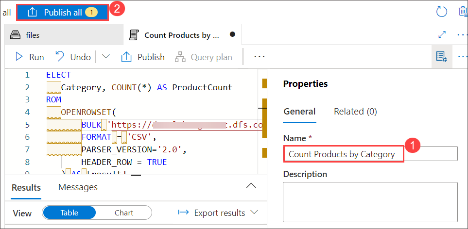

    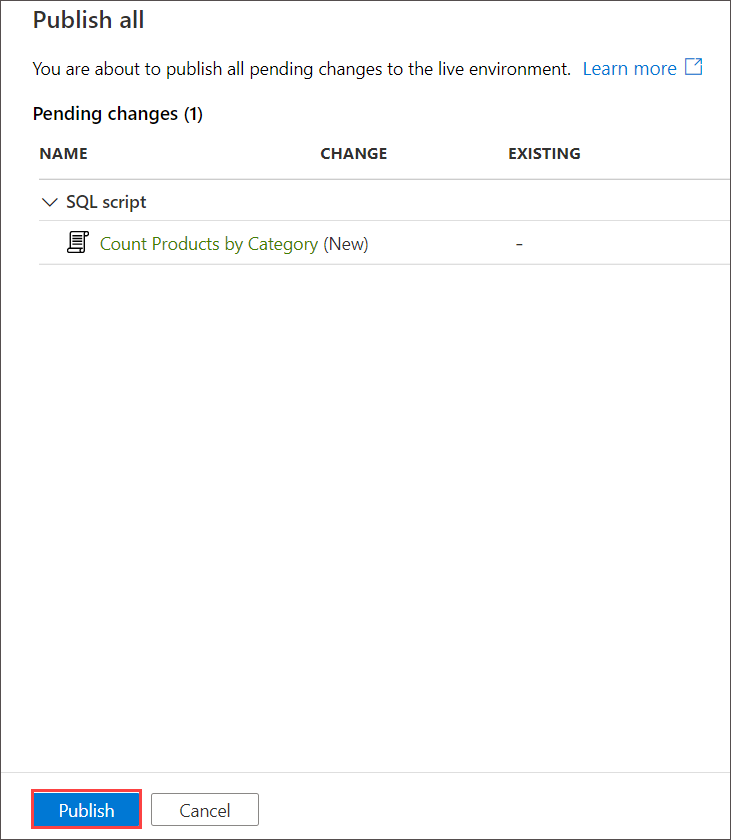

9. Close the **Count Products by Category** script pane.

10. In Synapse Studio, select the **Develop** page, and notice that your published **Count Products by Category** SQL script has been saved there.

11. Select the **Count Products by Category** SQL script to reopen it. Then ensure that the script is connected to the **Built-in** SQL pool and run it to retrieve the product counts.

12. In the **Results** pane, select the **Chart** view, and then select the following settings for the chart:
    - **Chart type**: Column
    - **Category column**: Category
    - **Legend (series) columns**: ProductCount
    - **Legend position**: bottom - center
    - **Legend (series) label**: *Leave blank*
    - **Legend (series) minimum value**: *Leave blank*
    - **Legend (series) maximum**: *Leave blank*
    - **Category label**: *Leave blank*

    The resulting chart should resemble this:

    

## Task 5: Use a Spark pool to analyze data

While SQL is a common language for querying structured datasets, many data analysts find languages like Python useful to explore and prepare data for analysis. In Azure Synapse Analytics, you can run Python (and other) code in a *Spark pool*; which uses a distributed data processing engine based on Apache Spark.

In this task, we will analyze data using a Spark pool by running PySpark code to load and process data, perform aggregations, and visualize results with charts.

1. In Synapse Studio, if the **files** tab you opened earlier containing the **sales.csv** file is no longer open, on the **Data** page, browse **sales_data** folder. Then right-click **sales.csv**, point to **New notebook**, and select **Load to DataFrame**.

   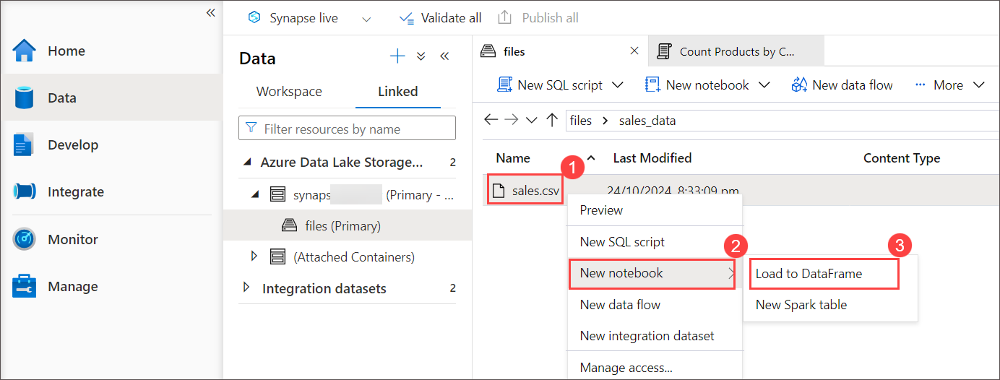

2. In the **Notebook 1** pane that opens, in the **Attach to** list, select the **sparkxxxxxxx** Spark pool and ensure that the **Language** is set to **PySpark (Python)**.

    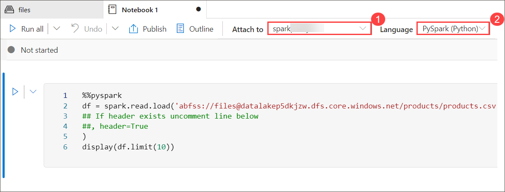

3. Review the code in the first (and only) cell in the notebook, which should look like this:

    ```Python
    %%pyspark
    df = spark.read.load('abfss://files@datalakexxxxxxx.dfs.core.windows.net/sales_data/sales.csv', format='csv'
    ## If header exists uncomment line below
    ##, header=True
    )
    display(df.limit(10))
    ```

4. Use the **&#9655;** icon to the left of the code cell to run it, and wait for the results. The first time you run a cell in a notebook, the Spark pool is started - so it may take a minute or so to return any results. Eventually, the results should appear below the cell, and they should be similar to this:

    | _c0_ | _c1_ | _c2_ | _c3_ |
    | -- | -- | -- | -- |
    | ProductID | ProductName | Category | ListPrice |
    | 771 | Mountain-100 Silver, 38 | Mountain Bikes | 3399.9900 |
    | 772 | Mountain-100 Silver, 42 | Mountain Bikes | 3399.9900 |
    | ... | ... | ... | ... |

    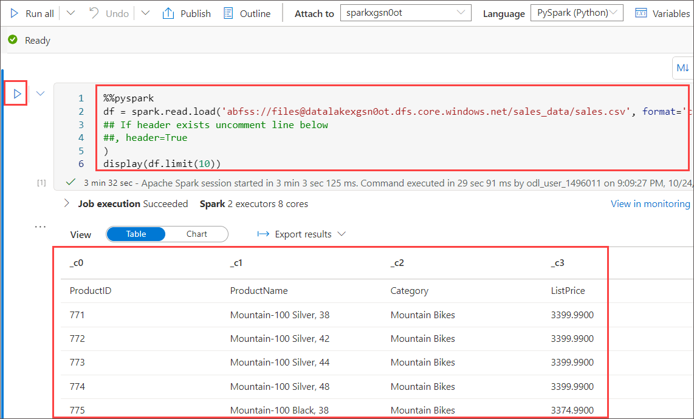

5. Uncomment the *,header=True* line (because the sales.csv file has the column headers in the first line), so your code looks like this:

    ```Python
    %%pyspark
    df = spark.read.load('abfss://files@datalakexxxxxxx.dfs.core.windows.net/sales_data/sales.csv', format='csv'
    ## If header exists uncomment line below
    , header=True
    )
    display(df.limit(10))
    ```

6. Rerun the cell and verify that the results look like this:

    | ProductID | ProductName | Category | ListPrice |
    | -- | -- | -- | -- |
    | 771 | Mountain-100 Silver, 38 | Mountain Bikes | 3399.9900 |
    | 772 | Mountain-100 Silver, 42 | Mountain Bikes | 3399.9900 |
    | ... | ... | ... | ... |

    Notice that running the cell again takes less time, because the Spark pool is already started.

7. Under the results, use the **&#65291; Code** icon to add a new code cell to the notebook.

    > **Note**: If the **+ Code** option isn't visible, try hovering your mouse cursor below the results to reveal it.

8. In the new empty code cell, add the following code:

    ```Python
    df_counts = df.groupby(df.Category).count()
    display(df_counts)
    ```
     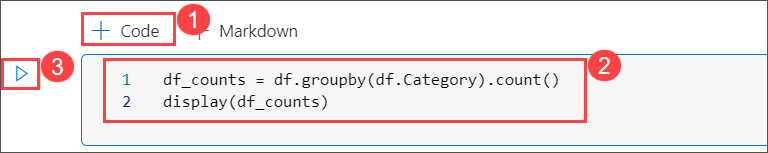

9. Run the new code cell by clicking its **&#9655;** icon, and review the results, which should look similar to this:

    | Category | count |
    | -- | -- |
    | Headsets | 3 |
    | Wheels | 14 |
    | ... | ... |

10. In the results output for the cell, select the **Chart** view. The resulting chart should resemble this:

    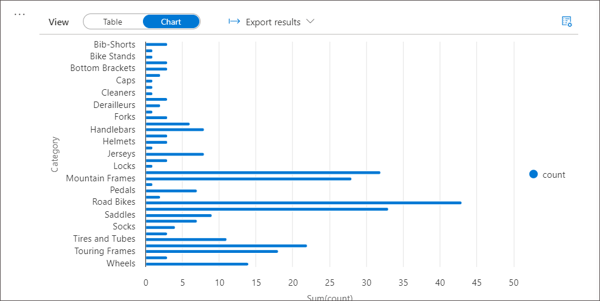

11. If it is not already visible, show the **Properties** page by selecting the **Properties** button (which looks similar to **&#128463;<sub>*</sub>**) on the right end of the toolbar. Then in the **Properties** pane, change the notebook name to **Explore sales** and use the **Publish** button on the toolbar to save it.

12. Close the notebook pane and stop the Spark session when prompted. Then view the **Develop** page to verify that the notebook has been saved.

## Task 6: Use a dedicated SQL pool to query a data warehouse

So far you've seen some techniques for exploring and processing file-based data in a data lake. In many cases, an enterprise analytics solution uses a data lake to store and prepare unstructured data that can then be loaded into a relational data warehouse to support business intelligence (BI) workloads. In Azure Synapse Analytics, these data warehouses can be implemented in a dedicated SQL pool.

In this task, we will query a data warehouse using a dedicated SQL pool. We will execute SQL queries to retrieve and aggregate sales data and save the queries for future use.

1. In Synapse Studio, on the **Manage** page, in the **SQL pools** section, select the **sql*xxxxxxx*** dedicated SQL pool row and then use its **&#9655;** icon to resume it. Select **Resume** when prompted.

   .png)

   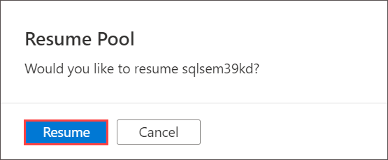


2. Wait for the SQL pool to start. This can take a few minutes. Use the **&#8635; Refresh** button to check its status periodically. The status will show as **Online** when it is ready.

   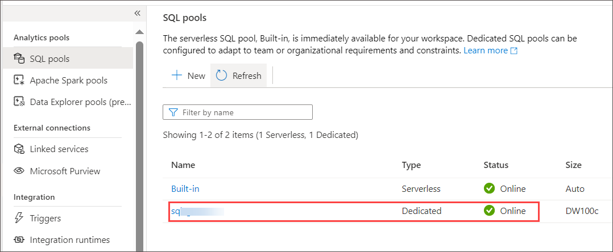

3. When the SQL pool has started, select the **Data** page; and on the **Workspace** tab, expand **SQL databases** and verify that **sql*xxxxxxx*** is listed (use **&#8635;** icon at the top-left of the page to refresh the view if necessary).
4. Expand the **sql*xxxxxxx*** database and its **Tables** folder,  and then in the **...** menu for the **FactInternetSales** table, point to **New SQL script**, and select **Select TOP 100 rows**.

   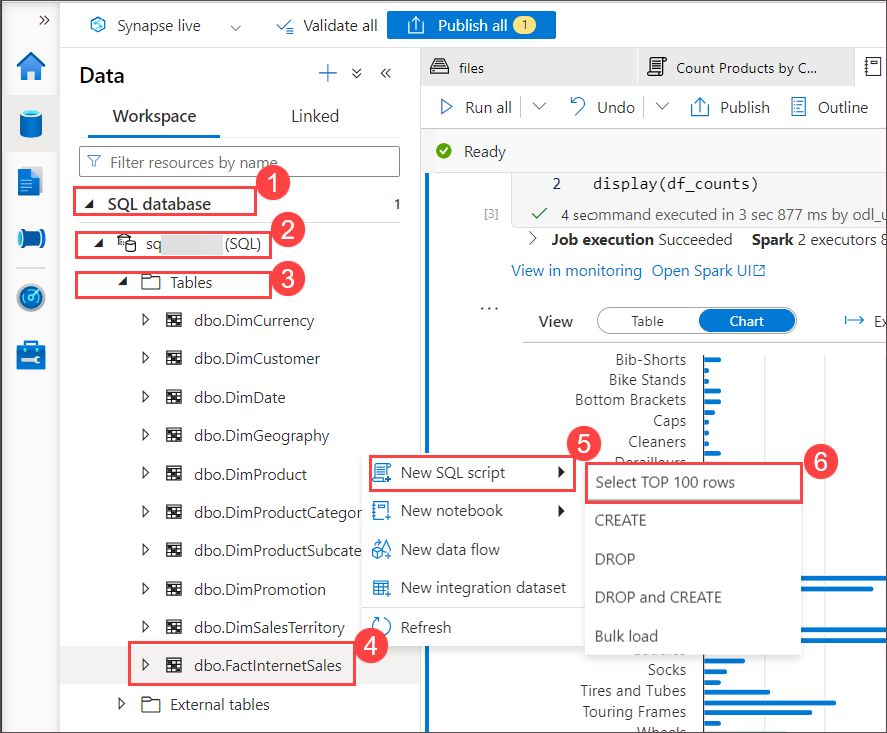

5. Review the results of the query, which show the first 100 sales transactions in the table. This data was loaded into the database by the setup script, and is permanently stored in the database associated with the dedicated SQL pool.
6. Replace the SQL query with the following code:

    ```sql
    SELECT d.CalendarYear, d.MonthNumberOfYear, d.EnglishMonthName,
           p.EnglishProductName AS Product, SUM(o.OrderQuantity) AS UnitsSold
    FROM dbo.FactInternetSales AS o
    JOIN dbo.DimDate AS d ON o.OrderDateKey = d.DateKey
    JOIN dbo.DimProduct AS p ON o.ProductKey = p.ProductKey
    GROUP BY d.CalendarYear, d.MonthNumberOfYear, d.EnglishMonthName, p.EnglishProductName
    ORDER BY d.MonthNumberOfYear
    ```

7. Use the **&#9655; Run** button to run the modified query, which returns the quantity of each product sold by year and month.
8. If it is not already visible, show the **Properties** page by selecting the **Properties** button (which looks similar to **&#128463;<sub>*</sub>**) on the right end of the toolbar. Then in the **Properties** pane, change the query name to **Aggregate product sales** and use the **Publish** button on the toolbar to save it.

9. Close the query pane, and then view the **Develop** page to verify that the SQL script has been saved.

10. On the **Manage** page, select the **sql*xxxxxxx*** dedicated SQL pool row and use its &#10074;&#10074; icon to pause it. Click **Pause** if prompted.

    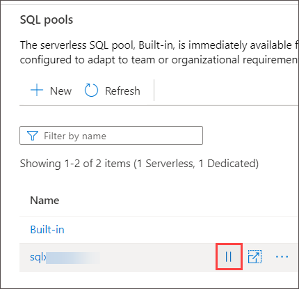

    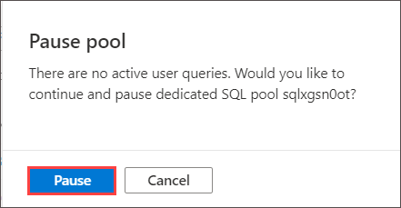

## Summary

In this lab, we provisioned an Azure Synapse Analytics workspace using PowerShell and an ARM template. We explored Synapse Studio to manage resources and ingest data from an HTTP source to Azure Data Lake Storage Gen2 via a pipeline. We analyzed the data using both serverless SQL and Spark pools, visualizing results with PySpark and querying a dedicated SQL pool for sales data. This lab highlighted Azure Synapse Analytics' capabilities for data ingestion, analysis, and management.

## Review

In this lab, you have accomplished the following:
- Provision an Azure Synapse Analytics workspace
- Explore Synapse Studio
- Ingesting data with a pipeline in Synapse Studio
- Analyze data using a serverless SQL pool
- Analyze data using the Spark pool
- Query a data warehouse using a dedicated SQL pool

## You have successfully completed the lab.
